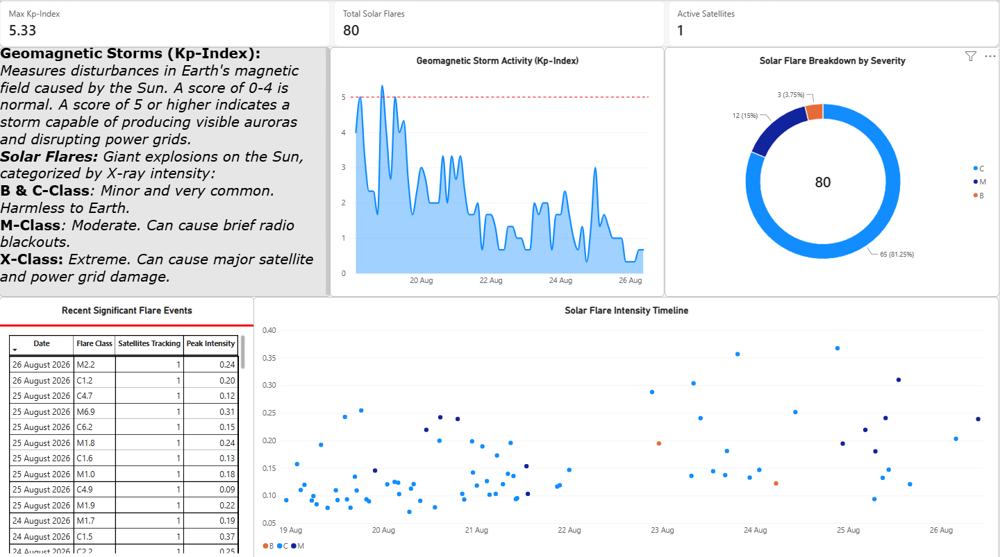

# ☀️ Space Weather Tracker

A small pipeline that quietly watches the sun, all day, every day, and turns real solar flare activity and geomagnetic storm data into a Power BI report you can actually make sense of at a glance.

## Preview

Three cards up top give the headline numbers at a glance — max Kp-index in the window, total flares tracked, and how many GOES satellites are actively reporting. The gray panel on the left is a plain-language legend, spelling out what the Kp-index actually measures and what each flare class (B/C/M/X) means in practice, since those labels aren't self-explanatory.

The middle chart is geomagnetic storm activity — Kp-index over time, with a red dashed line at Kp = 5 marking the official storm threshold, so any period where the line pokes above it is a real geomagnetic storm. To its right, a donut chart breaks the flare count down by severity (C-class dominates, as it almost always does — M and X are the rarer, more energetic events). Along the bottom, a table lists recent significant flare events (date, class, satellite, peak intensity) next to a scatter plot of every flare's peak intensity over time, colored by class, so you can see activity ramping up or quieting down across the rolling week.

## What this is, and why it exists

This is the third sibling project in this series, after [`tracking_metals`](../tracking_metals) and [`earthquake_tracker`](../earthquake_tracker) — same basic idea, different signal. This one watches the sun and Earth's magnetic field: solar flares (classified C/M/X by intensity) and the planetary K-index (the standard 0-9 scale for geomagnetic storm severity), both sourced straight from NOAA's Space Weather Prediction Center, collected on autopilot in the background.

Unlike the other two projects, this one deliberately tracks **two different data shapes in one pipeline**: solar flares are discrete events (a flare starts, peaks, and ends — insert it once, keep it forever), while the Kp-index is a continuous running measurement (NOAA revises the current few hours as more ground stations report in, so it needs to be kept up to date, not frozen at first sight). That distinction mirrors `tracking_metals`' `conflict_events` (discrete) vs `live_commodity_prices` (continuous) split, just combined into a single project instead of two.

## How the pipeline works, today

Every 15 minutes, a script on this machine hits two NOAA SWPC feeds, parses them, and writes to two tables in a local PostgreSQL database. Power BI reads from that same database, and whenever you want an up-to-date view, you open the report and hit Refresh. Same loop as `earthquake_tracker` — no servers to maintain, no cloud costs, nothing to babysit.

**A bit more detail on how it stays reliable:**

- **The flare feed:** NOAA publishes a rolling 7-day window of GOES X-ray flare events — free, no API key, no geocoding needed (nothing here is location-based). Pulling the whole week on every run means a missed run or a sleeping laptop can never cause a gap.
- **No stable id for flares:** NOAA doesn't publish one, so `space_weather_tracker.py` composes a natural key from `(begin_time, satellite)` — two satellites can observe overlapping flares, so satellite has to be part of the key.
- **Flares are insert-only:** keyed on that composed id, `ON CONFLICT (flare_id) DO NOTHING`. A flare's classification is settled shortly after it ends, so re-processing the same flare on a later run is a safe no-op.
- **The Kp-index feed is different on purpose:** it's a continuous measurement, not an event, and NOAA's most recent 1-2 readings are running estimates that get more accurate as more ground stations report in (`station_count` climbs over the following hours). So this table **upserts** (`ON CONFLICT (time_tag) DO UPDATE`) instead of insert-only — the last few periods stay current instead of getting frozen at their least-complete reading.

## What each file actually is

| File | What it's for |
|---|---|
| `space_weather_tracker.py` | The whole pipeline: fetch both NOAA feeds, parse them, write to Postgres. This is what Task Scheduler runs every 15 minutes. |
| `space_weather_tracker_visuals.pbix` | The Power BI report itself — Kp-index storm chart, flare severity donut, flare timeline scatter, summary cards, and a browsable events table, all reading live from the local Postgres database. |
| `requirements.txt` | `requests` (call the NOAA feeds) and `psycopg2-binary` (talk to Postgres). |
| `.github/workflows/space_weather_tracker.yml` | A GitHub Actions workflow that exists but is intentionally dormant — same reason as the other two projects: GitHub's cloud runners can't reach `localhost:5432` on this machine. |
| `register-space-weather-task.ps1` | Sets up the Windows Scheduled Task that actually drives everything. Not tracked in this repo (machine-specific), described below so it can be recreated anywhere. |
| `space_weather_tracker.log` | Local run log. Not tracked in the repo, purely a local debugging aid. |

## The data itself

Two tables in the local `space_weather_tracker` Postgres database:

**`solar_flares`** — one row per flare event:

| Column | Where it comes from | Notes |
|---|---|---|
| `flare_id` (primary key) | composed from `begin_time` + `satellite` | NOAA doesn't publish its own event id |
| `begin_time` / `max_time` / `end_time` | NOAA's own timestamps | When the flare started, peaked, and ended |
| `begin_class` / `max_class` / `end_class` | NOAA's classification (e.g. `C4.7`, `M6.9`) | The standard A/B/C/M/X solar flare scale, at each stage |
| `max_xrlong` | peak X-ray flux (long wavelength) | The raw physical measurement behind the classification |
| `max_ratio` | peak ratio relative to background | |
| `satellite` | which GOES satellite observed it | Part of the natural key |
| `ingested_at` | — | When this pipeline first saw and stored the row |

**`geomagnetic_kp`** — one row per 3-hour period:

| Column | Where it comes from | Notes |
|---|---|---|
| `time_tag` (primary key) | NOAA's own period timestamp | Start of the 3-hour window |
| `kp` | NOAA's planetary K-index | 0-9 scale; **Kp ≥ 5 is officially a geomagnetic storm** |
| `a_running` | NOAA's running a-index | A linear-scale companion to Kp |
| `station_count` | number of ground stations contributing | Climbs toward the full network as a period "settles" |
| `ingested_at` | — | Last time this pipeline wrote/refreshed this row |

## Power BI

`space_weather_tracker_visuals.pbix` is a single-page report — see the [Preview](#preview) section above for what it actually looks like. It's built from:

- A **Kp-index area chart** over `time_tag`, with a reference line at Kp = 5 so a geomagnetic storm is visually obvious the moment the line crosses it.
- A **flare severity donut** breaking down the rolling window's flares by class (B/C/M/X).
- A **flare intensity scatter** (`begin_time` on the x-axis, `max_ratio` on the y-axis, colored by class) so you can see solar activity ramping up and down over the week.
- Summary cards: max Kp-index in the window, total flares tracked, active satellites.
- A table of recent significant flare events, for browsing individual rows.
- A plain-language legend explaining what Kp and each flare class actually mean, since those labels aren't self-explanatory to anyone who isn't already a space weather nerd.

**Getting the real, live data out of the `.pbix`:** the file in this repo is just the report *definition* — the charts, layout, and query logic — not a snapshot of data. It connects straight to a local Postgres database (`localhost`, database `space_weather_tracker`, tables `solar_flares` and `geomagnetic_kp`), so to see current numbers you need that database running on your own machine: follow "Setting this up somewhere else" below to get the pipeline collecting data, then open the `.pbix` in Power BI Desktop and hit **Refresh**. No `git pull` step is needed once it's set up — there's no committed data file standing between the source and the report, Power BI talks to the live database directly. If Power BI ever prompts for a login on refresh, use Power BI Desktop → File → Options and Settings → Data source settings to tell it to remember the Postgres credentials, so Refresh never stalls waiting on a prompt.

## Scheduling — where the automation actually lives

A Windows Scheduled Task named `SpaceWeatherTracker`, registered by running `register-space-weather-task.ps1` once. It fires every 15 minutes, runs `space_weather_tracker.py` in the background with no visible window (via `pythonw.exe`), and writes its own log. Re-running the registration script at any point just replaces the existing task with a fresh one.

Same two caveats as `earthquake_tracker`:
- Registered under an **interactive logon** — only runs while you're logged into Windows. Nothing is lost either way, since the rolling feed windows always cover the gap.
- PostgreSQL is set to start automatically with Windows, so it's already there waiting when the task runs.

Credentials for Postgres are never stored in this repo or in the task definition — `psycopg2` connects as the local `postgres` user with no password in the code at all; the actual password lives in `%APPDATA%\postgresql\pgpass.conf` on this machine, which libpq reads automatically (a dedicated line for the `space_weather_tracker` database, reusing the same local `postgres` user already set up for `earthquake_tracker`).

## About that GitHub Actions file

Same story as `earthquake_tracker`: `.github/workflows/space_weather_tracker.yml` exists but its scheduled trigger is deliberately switched off, because GitHub's cloud runners have no way to reach `localhost:5432` on this machine. Left as a manual-only trigger (`workflow_dispatch`) in case this project ever moves to a cloud-hosted Postgres instance both this machine and GitHub could reach.

## Setting this up somewhere else

1. Install PostgreSQL locally, service set to start automatically.
2. Create a database named `space_weather_tracker` (the script's `init_db()` creates both tables itself on first run).
3. Set up `pgpass.conf` (`%APPDATA%\postgresql\pgpass.conf` on Windows) with the connection details.
4. `pip install -r requirements.txt`.
5. Run `register-space-weather-task.ps1` to register the Scheduled Task (defaults to every 15 minutes; pass `-IntervalMinutes` to change that).
6. Open `space_weather_tracker_visuals.pbix` in Power BI Desktop, point its data source at your own Postgres instance, and refresh (see "Power BI" above for what's in it and how to access the live data).

No API keys, no paid services, no cloud infrastructure — just NOAA's free feeds, a local database, and a scheduled task doing its thing quietly in the background.
