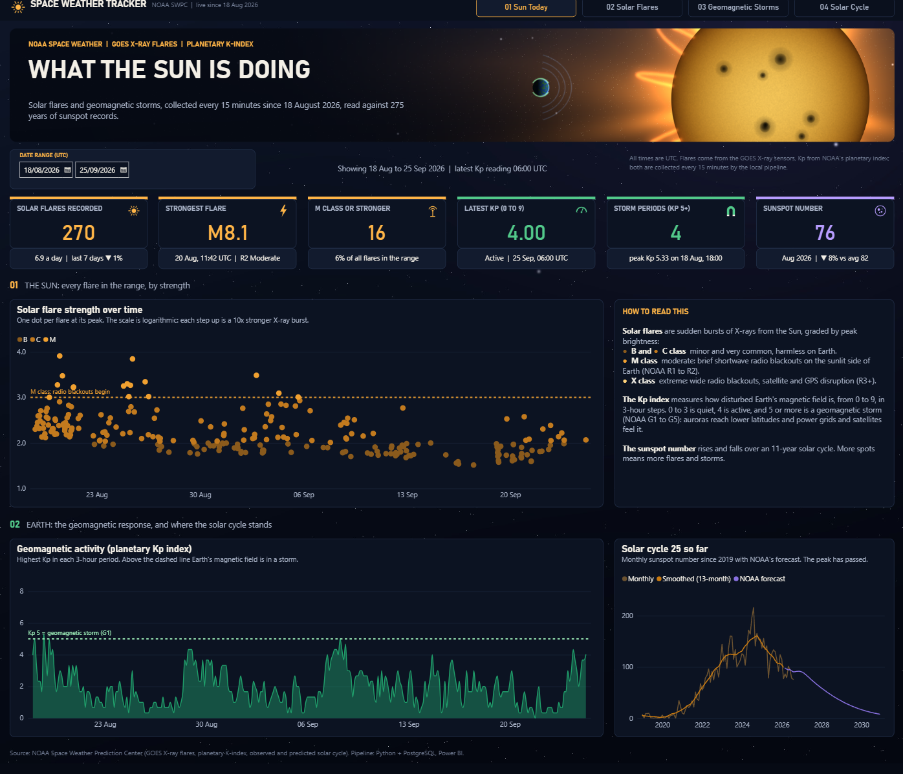
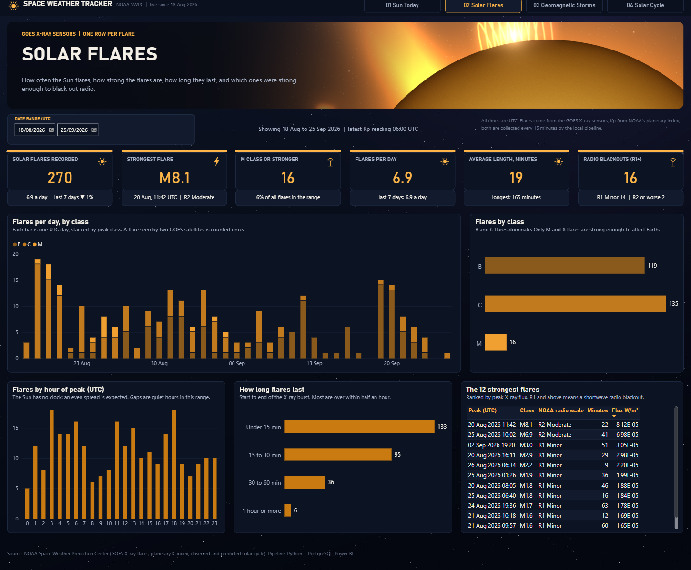
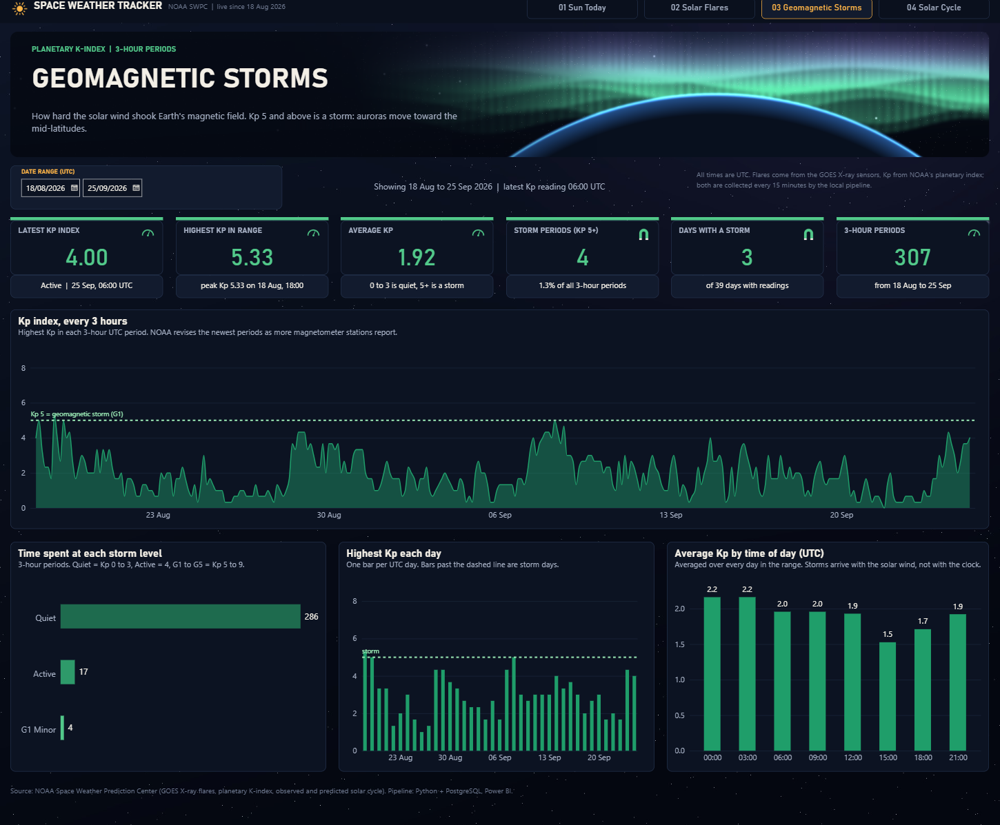
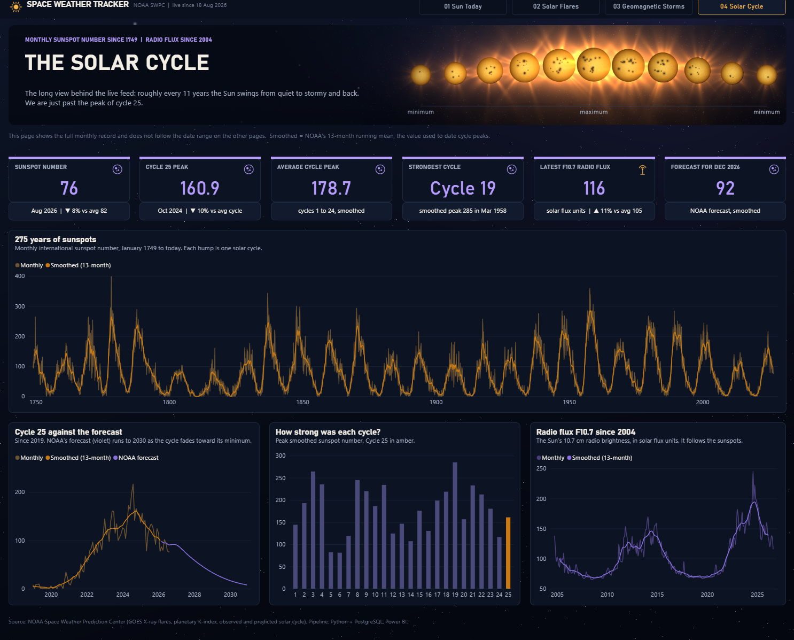

# ☀️ Space Weather Tracker

A small pipeline that watches the Sun around the clock. Every 15 minutes it collects solar flares and geomagnetic storm readings from NOAA, stores them in a local database, and a 4-page Power BI dashboard turns them into something anyone can read at a glance, set against 275 years of sunspot records.

## The dashboard

**1. Sun Today:** the headline numbers, every flare plotted by strength, Earth's magnetic response, and where the 11-year solar cycle stands.

**2. Solar Flares:** how many flares happen each day, how strong they are, when they peak, how long they last, and the strongest ones.

**3. Geomagnetic Storms:** the Kp index every 3 hours, how much time Earth spent at each storm level, and the daily peaks.

**4. Solar Cycle:** the long view: monthly sunspots since 1749, the strength of every cycle, and NOAA's forecast for the rest of cycle 25.

The banners, background and icons were drawn from scratch in Python (no stock images). Every KPI tile carries a comparison (for example "last 7 days vs average" or "vs the long-term average") so a number is never shown on its own.

## A 30-second guide to space weather

- **Solar flares** are sudden bursts of X-rays from the Sun, graded B, C, M and X. Each letter is 10 times stronger than the one before. B and C flares are harmless; M flares can black out shortwave radio for a while; X flares can disturb satellites and GPS.
- **The Kp index** (0 to 9) measures how shaken Earth's magnetic field is. 0 to 3 is quiet, 4 is active, and **5 or more is a geomagnetic storm**, when auroras reach further from the poles.
- **Sunspots** come and go in a cycle of about 11 years. More sunspots means more flares and storms.

## What the data showed (18 Aug to 25 Sep 2026)

- **270 solar flares** in 39 days, about 7 a day. 16 of them were M class, and the strongest was an **M8.1 on 20 August**, strong enough for a moderate radio blackout (NOAA R2). No X-class flares.
- Earth's magnetic field was quiet most of the time (average Kp 1.9). It reached storm level (Kp 5+) in only **4 of 307 three-hour periods**, on 3 days, all minor (G1) storms.
- The Sun is **past the peak of solar cycle 25**. The cycle peaked in October 2024 at a smoothed sunspot number of 161, about 10% below the average of the previous 24 cycles. The record still belongs to cycle 19 (1958).

## How it works

1. **Collect:** `space_weather_tracker.py` runs every 15 minutes (Windows Task Scheduler). It downloads NOAA's free feeds, with no API key needed:
   - solar flares from the GOES satellites (rolling 7 days),
   - the planetary Kp index (every 3 hours),
   - the monthly solar-cycle record: sunspots since 1749, radio flux since 2004, and NOAA's forecast.
2. **Store:** everything goes into a local PostgreSQL database. Flares are only added once; the Kp index and solar cycle are updated when NOAA revises recent values.
3. **Clean:** two small SQL views prepare the data for Power BI. They convert times to UTC, label flare classes and storm levels, and count each flare once (NOAA sometimes reports the same flare from two satellites).
4. **Show:** the Power BI report reads the database; open it and press **Refresh** for the latest data.

## What's in this repo

| File / folder | What it is |
|---|---|
| `space_weather_tracker.py` | The whole pipeline: download, store, and create the SQL views. |
| `powerbi/SpaceWeatherTracker_v2_claude_and_mine.pbip` | The current 4-page dashboard (Power BI project format; open this file). |
| `powerbi/SpaceWeatherTracker_v1_mine.pbix` | My first, single-page version of the report, kept for comparison. |
| `images/` | The dashboard screenshots shown above. |
| `requirements.txt` | Python packages: `requests` and `psycopg2-binary`. |
| `.github/workflows/` | A GitHub Actions workflow kept switched off: GitHub's servers can't reach a database on my own computer. |

## Run it yourself

1. Install PostgreSQL and create an empty database called `space_weather_tracker`.
2. Save your database password in `pgpass.conf` (`%APPDATA%\postgresql\pgpass.conf` on Windows) so it never appears in the code.
3. `pip install -r requirements.txt`, then run `python space_weather_tracker.py` once. It creates the tables and views itself.
4. Schedule the script to run every 15 minutes (for example with Windows Task Scheduler).
5. Open `powerbi/SpaceWeatherTracker_v2_claude_and_mine.pbip` in Power BI Desktop and click **Refresh**.

## Notes

- Source: [NOAA Space Weather Prediction Center](https://www.swpc.noaa.gov/). All times are in UTC.
- Live flare and Kp data starts on 18 August 2026, when the tracker was switched on. The solar-cycle history comes from NOAA's archive.
- The "strength" axis on the flare chart is logarithmic: 1 = B, 2 = C, 3 = M, 4 = X.
